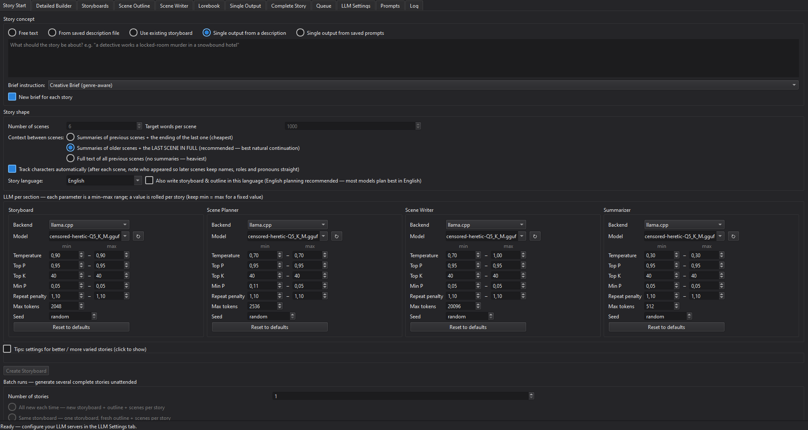
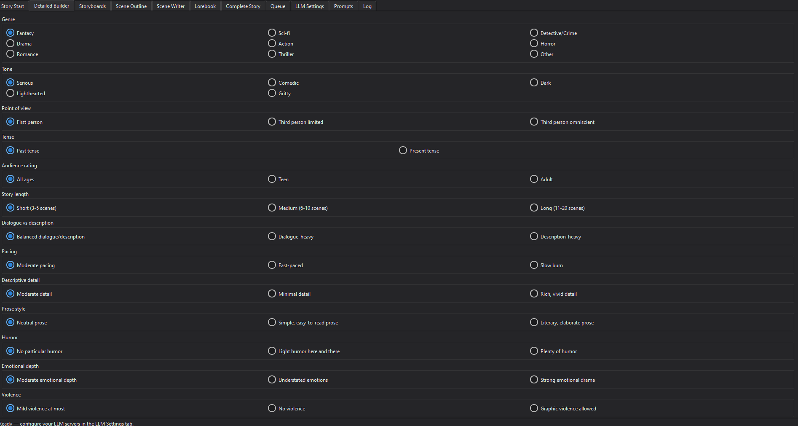
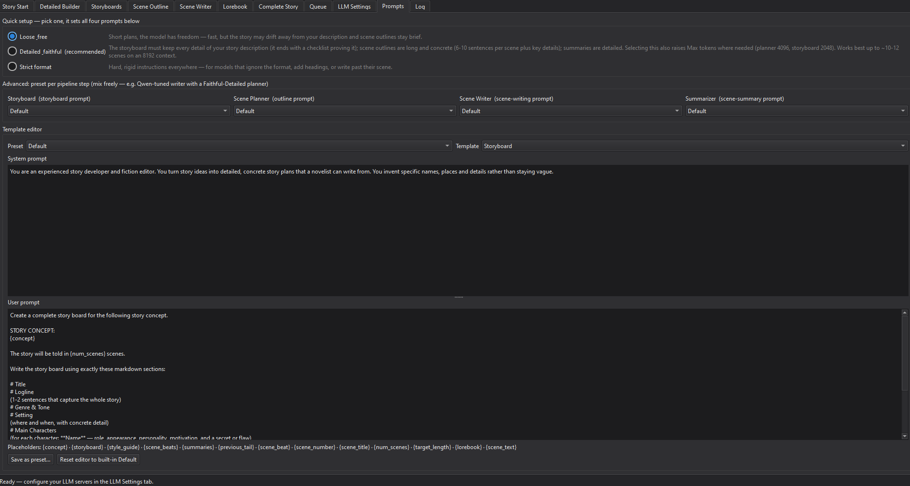

# Story Creator — Local LLM Story Writer

I created this app by using Claude 5.

added "single output from a description" and "single output from saved prompts".
"single output from a description" if you type like "a drama about a amateur boxer" then it does 2 llm calls, 
first call it creates a system prompt and a user prompt and the second llm call uses that system and user prompt
for a single output for the whole story, this works on llm models that can generate 
long single output, tested on these models, not perfect but it generates the output:

Qwen3.8-27B-Uncensored-HauhauCS-Aggressive-Q4_K_P.gguf - about 7000-10000 tokens output.
LongCat-Flash-Lite-uncensored-heretic-Native-MTP-Preserved-Q5_K_M.gguf - about 7000-13000 token output.

The rest of the readme is created by Claude. 



Cross-platform (Windows/Linux/Mac) PySide6 desktop app that writes long,
multi-scene stories with **local LLMs**. Because local models typically produce
700–2000 tokens per response, the app splits story writing into a staged
pipeline, each stage one LLM call:

**concept → storyboard → scene outline → scene-by-scene prose (streamed live)**

If your model can sustain a long single response, **single-output mode** skips
that pipeline entirely and writes the whole story in one call instead — see
the Single Output tab below.

Continuity between scenes is kept with per-scene summaries (or the full text of
all previous scenes, if you prefer) plus the verbatim ending of the previous
scene, automatically trimmed to fit the model's context window.

## Supported backends

| Backend        | Default URL              | Start it with                     |
|----------------|--------------------------|-----------------------------------|
| KoboldCpp      | http://localhost:5001    | `koboldcpp.exe --model x.gguf`    |
| llama.cpp      | http://localhost:8080    | `llama-server -m x.gguf`          |
| Ollama         | http://localhost:11434   | `ollama serve` + `ollama pull …`  |

Each pipeline section — **Storyboard, Scene Planner, Scene Writer,
Summarizer** — can use a different backend and model: small fast models for
planning and summaries, your biggest model for the prose. Thinking models
(Qwen3 etc.) are handled: their hidden reasoning is shown live but stripped
from the story text.

In single-output mode the same two sections are reused: **Storyboard** writes
the brief (a small model is fine) and **Scene Writer** writes the whole story
in one call, so nothing extra needs configuring.

## Install & run

```
pip install -r requirements.txt
python app.py
```

Python 3.10+ required.

### Linux note

Modern distros (Ubuntu 23.04+/Debian 12+) refuse system-wide `pip install`
("externally-managed-environment") — create a virtual environment first:

```
python3 -m venv .venv
source .venv/bin/activate
pip install -r requirements.txt
python app.py
```

(Activate it again with `source .venv/bin/activate` whenever you open a new
terminal.)

If the app aborts with *"Could not load the Qt platform plugin xcb"*, install
the one library Qt ≥ 6.5 needs that most distros don't preinstall:

```
sudo apt install libxcb-cursor0
```

(That exact package is named in the error message.) On a Wayland desktop you
can alternatively run `QT_QPA_PLATFORM=wayland python app.py` without
installing anything. Installing system Qt packages (`qt6-base-dev` etc.) does
not help — pip's PySide6 bundles its own Qt.

## The tabs

1. **Story Start** — story source: free text (saveable), a saved description
   file (editable in place), or an **existing storyboard file** (skips
   storyboard generation — every run makes a fresh outline + scenes from that
   finished board), **single output from a description**, or **single output
   from saved prompts** · per-section backend/model choice · sampling
   parameters as **min–max ranges** rolled randomly once per story (same value
   for all scenes of a story; min = max for fixed) · KoboldCpp extras
   (smoothing factor, TFS, Typical P, Top A) · number of scenes, target words
   per scene · story language (prose in Svenska/… while planning stays in
   English) · context mode (see below) · **batch runs**.
2. **Detailed Builder** — compose a detailed story description with radio
   options (genre, tone, POV, rating, dialogue amount, pacing, detail level,
   prose style, humor, emotional depth, violence, romance, ending) and save it
   as a reusable description file.
3. **Storyboards** — reusable storyboard library: the latest run's boards on
   top, older ones below. Edit, regenerate, duplicate, rename; one storyboard
   can seed any number of stories ("Use for New Story →").
4. **Scene Outline** — the scene plan of the current story: edit fields, add,
   delete, drag to reorder; streams live while generating.
5. **Scene Writer** — scene list left, prose right, **streaming live** (switch
   scenes freely mid-generation, nothing is lost). Write Next / Regenerate /
   Continue / Auto-Write All. Each scene's editable summary sits below the
   text, with a Re-summarize button. "Show Last Prompt" reveals exactly what
   was sent.
6. **Lorebook** — world & character facts tied to a storyboard, injected into
   the scene prompt when their keywords appear; import characters from the
   storyboard automatically.
7. **Single Output** — write a whole story in one LLM call. Pick a **brief
   instruction** (11 built in — Detective, Thriller, Romance, Drama, Horror,
   Fantasy, genre-aware, first/third person … — editable, and you can save
   your own), type what the story should be about, and **Generate Brief**: a
   small model returns a **system prompt** (how to write it) and a **user
   prompt** (what to write), both editable and saved to `briefs/` for reuse.
   **Write Story** sends that pair to the writing model verbatim. You can also
   load your own prompts from `system-prompts/` and `user-prompts/` instead of
   generating a brief, or save the boxes back out as `.txt`. A budget line
   warns before you start if Max tokens is too small for a whole story.
8. **Complete Story** — every saved story (newest first), combined text view,
   export .txt/.md, reopen any story as the current one. Finished stories are
   also auto-exported to `output/`.
9. **Queue** — every "Run Batch" click becomes a queue item with a full
   snapshot of the settings at that moment; items run one after another. Shows
   "story 3 of 10" progress. Finish Story Skip Rest / Cancel Item / Remove /
   Clear / Stop All / Resume.
10. **LLM Settings** — per-server settings (URL, chat template Auto/manual,
   context length, timeout with infinite default, Test Connection, reset to
   defaults) plus the dark/light theme switch.
11. **Prompts** — a plain-language **Quick setup** (Loose & free / Detailed &
    faithful / Strict format) sets all four prompts with one click — "Detailed
    & faithful" binds the storyboard to your story description (it must end
    with a checklist proving nothing was dropped), demands rich 6-10-sentence
    scene outlines with key details and character focus, and raises Max tokens
    where needed. Below it: per-section preset dropdowns (Default, Strict,
    Qwen-tuned, Gemma-tuned, Detailed-Summary, Faithful-Detailed — mix
    freely) and a full template editor to save your own presets.
12. **Log** — every LLM call with backend, model, rolled parameters and prompt
    size. Opt-in detail checkboxes (scene summaries, each section's full
    prompts, full responses) for debugging bad stories. Size-capped
    (configurable, oldest half dropped automatically).

### Detailed Builder tab



### Prompts tab



## Tested models

Mostly tested with these Gemma builds (non-thinking — they just write):

- https://huggingface.co/llmfan46/gemma-4-31B-it-uncensored-heretic-GGUF
- https://huggingface.co/HauhauCS/Gemma-4-E4B-Uncensored-HauhauCS-Aggressive

**Thinking models (Qwen 3.5 and other Qwen thinking builds) need roughly
DOUBLE the Max tokens on every section** — the hidden reasoning eats from the
same reply budget, so with normal budgets responses get cut off and the
summarizer may produce no summary at all. Worse, Qwen's thinking mode **loops
endlessly at low temperature** (Qwen's own docs warn against near-greedy
decoding), which hits the Summarizer hardest since it runs at temp 0.3 for
accuracy. The app detects both cases and fixes them automatically on retry —
bigger budget, temperature raised to ≥0.7, and Qwen's `/no_think` switch, then
one last try with the whole remaining context — and keeps whatever worked for
the rest of the session. If a model only ever produces reasoning for a task,
it is marked as such and later calls fail fast into the excerpt fallback
instead of burning minutes per scene (pressing **Re-summarize Scene** always
forces a real new attempt). Still, setting generous Max tokens up front (Scene
Writer 4096+, Summarizer 2048+) avoids the wasted first attempts, and for
summaries a non-thinking model is simply the better tool.

Thinking is **visible while it happens**: reasoning streams into the scene box
and into the scene-summary box, so a slow thinking model never looks like a
frozen app — the clean text replaces it when the call finishes.

## Context & tokens

Everything sent for one scene — the storyboard, style guide, matched lorebook
entries, summaries of ALL earlier scenes, the verbatim ending of the previous
scene, the scene beat, **plus the Scene Writer's Max tokens reserved for the
reply** — must fit the server's context length (LLM Settings tab; it must
match what the server was started with, e.g. `llama-server -c 8192`). The
**Scene Writer tab shows the live budget per scene**; if it doesn't fit, the
app trims automatically (previous-scene ending first, then oldest summaries
get merged).

### Context between scenes

Three options on the Story Start tab, cheapest to heaviest:

| Mode | What scene 5 receives | Cost |
|------|----------------------|------|
| **Summaries + ending** | summaries of scenes 1-4 + last ~500 tokens of scene 4 | ~170 tok/scene |
| **Summaries + last scene in full** *(default)* | summaries of scenes 1-3 + **all of scene 4** | ~170/scene + ~1600 |
| **All scenes in full** | complete text of scenes 1-4 | ~1300+/scene |

The middle option is the sweet spot: the writer sees everything that actually
happened in the scene it must continue from — not just its final paragraph —
so scene 5 picks up naturally (she drove off → she arrives), while older
scenes stay compact as summaries. If the budget runs out the previous scene is
shortened to its ending first, then old summaries are merged.

Rules of thumb on an 8192 context: default summaries ≈170 tok/scene,
Detailed-Summary ≈340. "Detailed & faithful" is comfortable up to ~10-12
scenes; for longer stories use the cheapest context mode or start the servers
with a 16384 context.

Thinking models (Qwen3 etc.) are supported: their hidden reasoning streams
live but is stripped from the story. If a model spends its whole token budget
thinking, the call is retried once with a bigger budget automatically; a
summarizer that still fails falls back to a scene excerpt so batches never
die on it.

### Single output needs a much bigger budget

A brief asks for 5500-9000 words, which is roughly 7000-12000 tokens in one
reply. Set **Scene Writer Max tokens to ~8192-12288** and start the server
with a context large enough to hold that *plus* the prompt
(`koboldcpp --contextsize 32768`, `llama-server -c 32768`). Storyboard Max
tokens wants ~4096, since it has to return both prompts.

Two traps worth knowing. The context length in LLM Settings is only used by
the app's own budgeting — it is never sent to the server, so raising it there
does nothing if the model was loaded smaller. And `llama-server -n 4096` is a
hard ceiling on every request no matter what the app asks for; drop the flag
or set `-n -1`. When a reply stops well short of Max tokens the app says so
and points at the server rather than the setting.

## Batch runs

Generate N complete stories unattended, in three reuse modes:

- **All new each time** — new storyboard + outline + scenes per story
- **Same storyboard** — one storyboard, fresh outline + scenes per story
- **Same storyboard + outline** — N different tellings of the same plot

With "Use existing storyboard" on the Story Start tab, the batch never
generates a storyboard at all: 10 runs = 10 new stories (fresh outline +
scenes each) from the storyboard file you picked and edited.

Single-output batches work the same way, with their own choice: **a new brief
for each story** (every story differs in style as well as wording) or **one
brief for all of them** (N tellings from the same pair of prompts). Picking a
saved brief or your own `.txt` prompts always reuses them as they are.

Each story rolls fresh values from your min–max parameter ranges, is autosaved
to `projects/` (with the exact parameters used stored inside) and exported to
`output/` with a date-time filename.

## Folders (created at runtime)

```
story-descriptions/  saved story descriptions (Builder tab / Story Start)
storyboards/         reusable storyboards + their lorebooks
projects/            story projects (outline, scenes, summaries, gen params)
prompt-presets/      user-saved prompt presets
briefs/              generated (system prompt, user prompt) pairs, reusable
brief-instructions/  your own brief instructions (.txt)
system-prompts/      your own system prompts for single output (.txt)
user-prompts/        your own user prompts for single output (.txt)
output/              exported complete stories (.txt / .md)
settings.json        all app settings
story-creator.log    the log (size-capped)
```

## Tests

```
python test_smoke.py      # UI construction, parsing, budgeting, options — offscreen
python test_mock_llm.py   # full pipeline against a mock OpenAI-compatible SSE server
python test_ui_stream.py  # live streaming, batch queue, soft-stop — offscreen
```

The tests use a mock LLM server and an isolated settings file — they never
touch your real settings, stories, or servers.

## Contact

Questions, bug reports or suggestions are welcome:

- **Email:** tuonomindcode [at] bahnhof [dot] se
